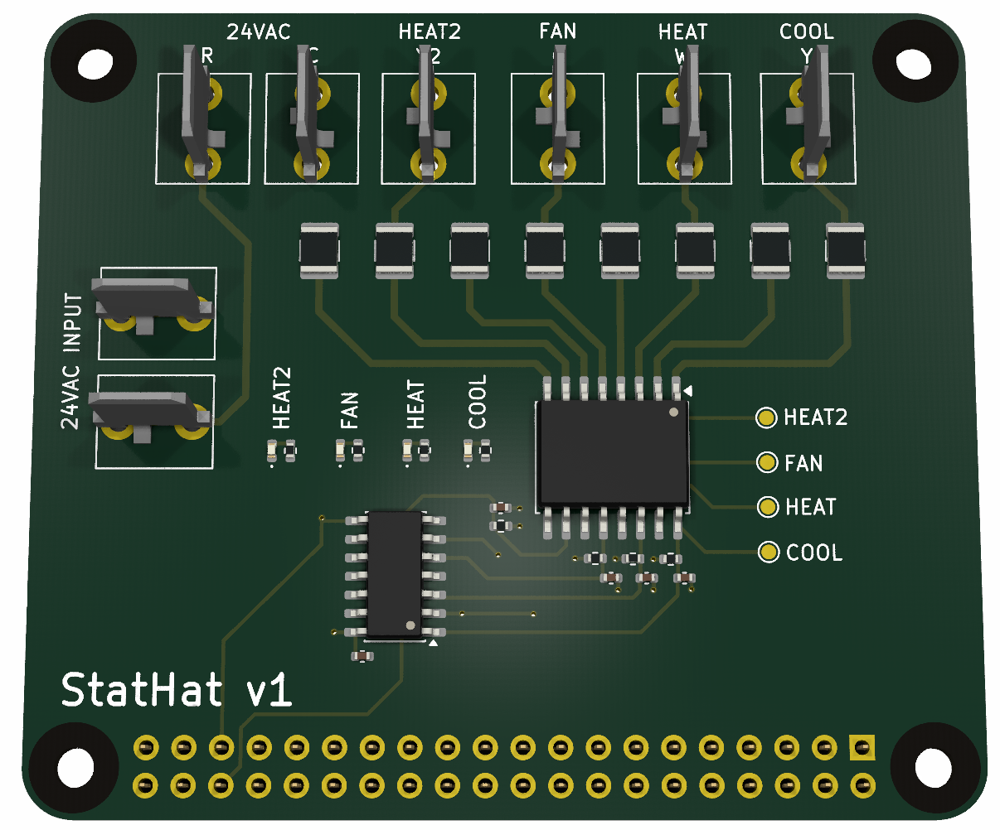

## StatHat

A RPi Hat interface to a 24VAC thermostat.

### Thermostat Pins

| Thermostat pin name | Pin symbol | RPi GPIO |
| --- | --- | --- |
| COOL | `Y` | `GPIO17` (physical pin 11) |
| HEAT | `W` | `GPIO16` (physical pin 36) |
| FAN | `G` | `GPIO18` (physical pin 12) |
| HEAT2 | `W2` | `GPIO19` (physical pin 35) |
| COMMON | `C` | N/A |
